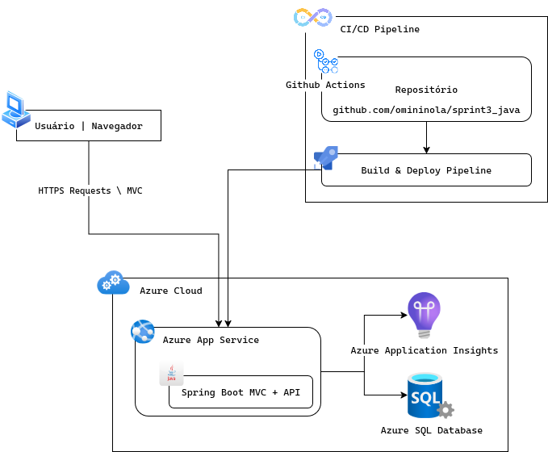

# Sprint 03 | Cloud

## Integrantes

| Nome |  RM  |
| ---- | :--: |
| Otavio Miklos Nogueira | 554513 |
| Luciayla Yumi Kawakami | 557987 |
| João Pedro Amorim Brito | 559213 |

## Links
Youtube: [https://youtu.be/mk68QvOxX-Y](https://youtu.be/mk68QvOxX-Y)

## Descrição
A aplicação é uma API juntamente com um projeto MVC ambos desenvolvidos com o auxílio do Spring Boot, o projeto possui 3 fluxos principais, o primeiro é o de login/cadastro onde é possível entrar ou criar uma conta, garantindo assim o acesso aos demais fluxos. Outro fluxo interessante é o de criar uma nova filial, onde você insere o nome e o endereço. Com uma nova filial em mãos, você pode adicionar motos a essa filial. Garantindo assim uma organização melhor para cada filial da Mottu.

## Benefícios
Garantir a organização geral das filiais e ter um controle e uma visão clara das filiais já existentes e das motos que cada uma delas possui. A aplicação é simples, o que facilita o uso para os organizadores de pátio.

## Arquitetura 


## Deploy

### Setup

#### Clonando

```bash
# Clone esse repositório para ter acesso aos scripts
git clone https://github.com/omininola/sprint3_cloud

# Clone o repositório para ser deployado
git clone https://github.com/omininola/sprint3_java_deploy
```

#### Desvinculando o Repositório de Deploy

```bash
# Remova a pasta .git para desvincular o repositório de deploy
# Unix
rm -rf sprint3_java_deploy/.git

# Windows
rmdir /s /q sprint3_java_deploy/.git
```

#### Criando seu repositório de deploy

Agora é preciso vincular esse repositório de deploy com um repositório de autoria sua, então acesse [https://github.com/new](https://github.com/new)

E crie um novo repositório

Depois volte para o terminal

```bash
# Entre no diretório do repo deploy
cd sprint3_java_deploy

# Inicie um novo repositório
git init

# Adicione as mudanças
git add .

# Commite
git commit -m "first commit"

# Vincule o repositório com a origin
# Lembre-se de mudar as informações abaixo
git remote add origin https://github.com/<SEU_USUARIO>/<SEU_REPOSITORIO>.git
git branch -M main
git push -u origin main
```

### Azure Setup

Agora que já temos o repositório de deploy preparado, podemos começar com os recursos da Azure. Antes de rodar o script_az.sh, é preciso mudar algumas informações dentro dele

```bash
export RESOURCE_GROUP="rg-sprint3"
export LOCATION="westus"

export APP_NAME="sprint3-java-app"
export APP_RUNTIME="JAVA|17-java17"
export APP_INSIGHTS="ai-sprint3"

# Mudar o seu user e repositório
export GITHUB_REPO="<SEU_USER_DO_GITHUB>/<SEU_REPOSITORIO_DEPLOY>"
export BRANCH="main"

# Mudar para o seu rm
export DB_SERVER_NAME="sprint3-cloud-<SEU_RM>"
export DB_NAME="sprint3"
export DB_USER="omininola"
export DB_PASS="SenhaForte123!"
```

Com essas alterações feitas, podemos enfim rodar o script

```bash
# Entre no diretório do script (Caso ainda não esteja)
cd sprint3_cloud

# Rode o script
./script_az.sh
```

#### Github Actions

Conforme os recursos vão sendo criados na Azure, o terminal recebe alguns logs de retorno. Em algum momento você verá um log avisando sobre conectar o app ao github e então vai abrir uma aba no seu navegador com um input de código, basta copiar o código que apareceu no seu terminal e colar, depois você autoriza o Azure mudar o seu repositório.

Algum tempo depois, seu diretório estará conectado com a Azure e o Github Actions vai se comunicar diretamente com ela para fazer o deploy e forma automática.

Agora que temos esse arquivo novo (.github/workflow/main_sprint3-java-app.yml), precisamos editar algumas informações dele:

```yml
# Docs for the Azure Web Apps Deploy action: https://github.com/Azure/webapps-deploy
# More GitHub Actions for Azure: https://github.com/Azure/actions

name: 'Build and deploy JAR app to Azure Web App: sprint3-java-app'

on:
  push:
    branches:
    - main
  workflow_dispatch:

jobs:
  build-and-deploy:
    runs-on: ubuntu-latest
    
    steps:
    - uses: actions/checkout@v2
    
    - name: Set up Java version
      uses: actions/setup-java@v1
      with:
        java-version: '17'
    
    - name: Build with Maven
    # Temos que adicionar essas variavies de ambiente
      env:
        SPRING_DATASOURCE_URL: ${{ secrets.SPRING_DATASOURCE_URL }}
        SPRING_DATASOURCE_USERNAME: ${{ secrets.SPRING_DATASOURCE_USERNAME }}
        SPRING_DATASOURCE_PASSWORD: ${{ secrets.SPRING_DATASOURCE_PASSWORD }}
      run: mvn clean install

    - name: Deploy to Azure Web App
      uses: azure/webapps-deploy@v2
      with: 
        app-name: 'sprint3-java-app'
        slot-name: 'production'
        publish-profile: ${{ secrets.AzureAppService_PublishProfile_deb2d72d20a446b5a6eb353ddb75d1ca }}
        package: '${{ github.workspace }}/target/*.jar'
```

Após mudar o arquivo, precisamos adicionar essas variaveis de ambiente em nosso repositório, basta acessar https://github.com/<SEU_USER>/<SEU_REPOSITORIO>/settings/secrets/actions e adicionar os seguintes segredos:
- SPRING_DATASOURCE_PASSWORD = SenhaForte123!
- SPRING_DATASOURCE_USERNAME = omininola@sprint3-cloud-<SEU_RM>
- SPRING_DATASOURCE_URL = jdbc:sqlserver://sprint3-cloud-<SEU_RM>.database.windows.net:1433;database=sprint3;encrypt=true;trustServerCertificate=false;hostNameInCertificate=*.database.windows.net;loginTimeout=30;

Essas variáveis devem estar de acordo com o que está dentro de sprint3_cloud/script_az.sh

```bash
export DB_SERVER_NAME="sprint3-cloud-<SEU_RM>"
export DB_NAME="sprint3"
export DB_USER="omininola"
export DB_PASS="SenhaForte123!"
```

### Commit

Depois de fazer todas essas alterações, você já pode commitar e ele deveria fazer o deploy de forma automática!
```bash
# Adicione as mudanças
git add .

# Commit
git commit -m "chore: deploy vars"

# Push
git push origin main
```

## Testes